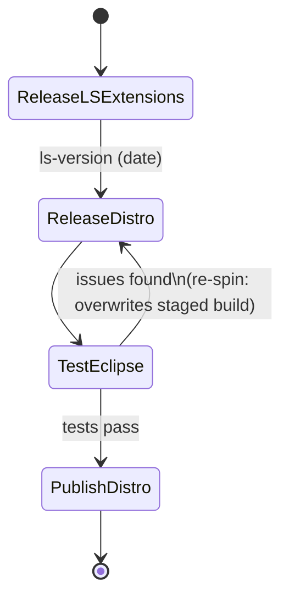
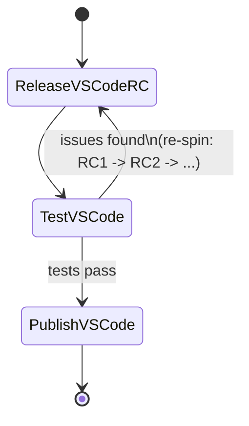
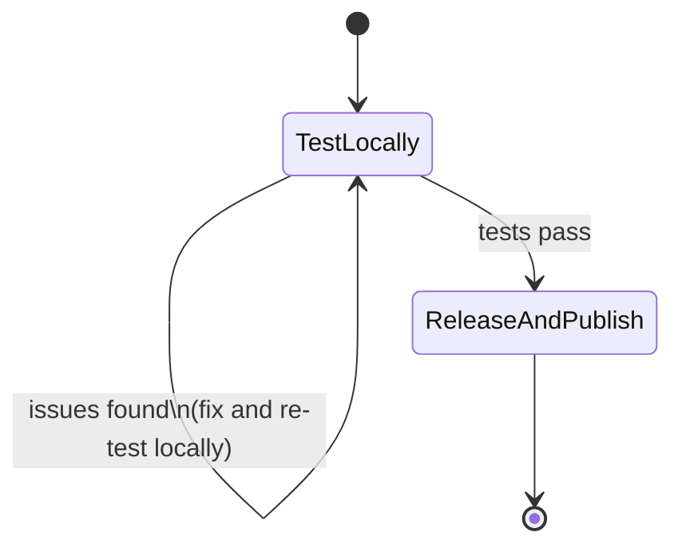
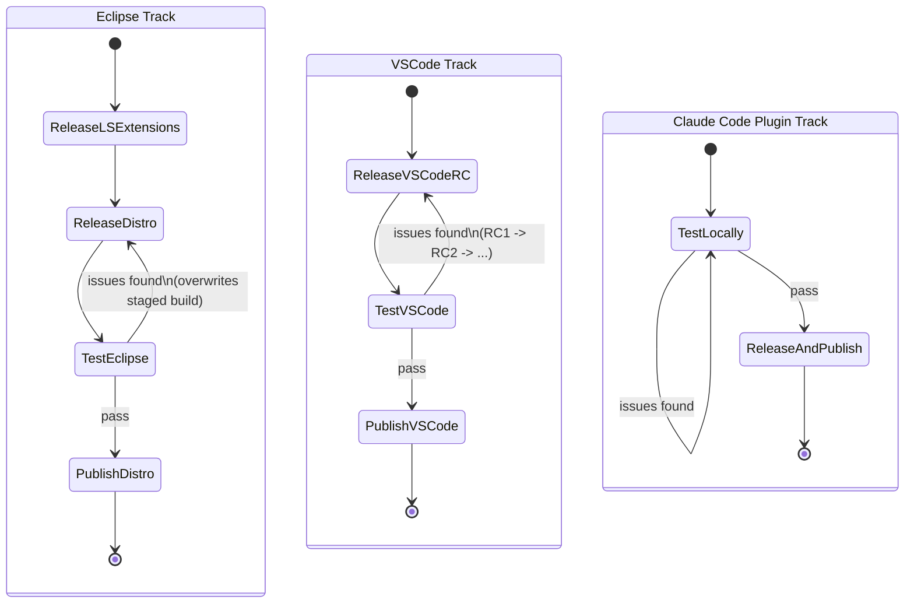

# Spring Tools Release Process

Spring Tools ships three independent release tracks that all build on the
Java language servers but are released, tested, and published on their own
schedules:

- **Eclipse track** — Eclipse LS Extensions → Eclipse Distribution → Test → Publish
- **VSCode track** — VSCode Extensions RC → Test → Publish
- **Claude Code plugin track** — Test locally → Release (build + publish)

The Eclipse and VSCode tracks each have their own release-candidate loop: if
testing turns up a problem in one track, only that track's release step is
re-spun. The other track keeps whatever candidate it already has and does
not need to be rebuilt. The Claude Code plugin track has no candidate/staging
step at all — see below.

Every step below except "Test" is a GitHub Actions workflow, triggered via
`workflow_dispatch` from the Actions tab (or `gh workflow run`).

## Prerequisite: Update Changelogs

Before kicking off *any* of the three tracks below, the changelog entries
for this release must be written and pushed:

- the wiki's `Changelog.md` (in the `spring-tools.wiki` repo)
- the `CHANGELOG.md` of whichever VSCode extension(s) are being released
  (typically just [`vscode-extensions/vscode-spring-boot/CHANGELOG.md`](vscode-extensions/vscode-spring-boot/CHANGELOG.md))

A draft is generated by the [`changelog-draft.yml`](.github/workflows/changelog-draft.yml)
workflow (input: `release`, e.g. `4.20.1.RELEASE`). Despite its "Push to
wiki" step name, it doesn't actually commit or push anything — it checks
out the wiki, runs `github-changelog-generator` against the given release
marker, prepends the result to a local copy of `Changelog.md`, and just
prints it to the job log. That printed content has to be copied by hand,
reformatted to match the existing entries' style (grouped bullet points
tagged by component, e.g. `_(Spring Boot)_`), and manually committed/pushed
to both the wiki and the relevant extension `CHANGELOG.md` file(s). This
manual reformatting step is a good candidate for AI-assisted automation.

## Eclipse Track

| # | Step | Workflow | Key inputs |
|---|------|----------|------------|
| 1 | Release Eclipse LS Extensions | [`release-eclipse-ls-extensions.yml`](.github/workflows/release-eclipse-ls-extensions.yml) | `sts-language-servers-version` — the date-based suffix of the p2 repo S3 path, e.g. `2026-09-03` |
| 2 | Release Eclipse Distribution | [`release-eclipse-distro-build.yml`](.github/workflows/release-eclipse-distro-build.yml) | `sts-language-servers-version` — **same date as step 1**; `qualifier` — `RELEASE` (default) |
| 3 | Test | — manual | Install/verify the staged Eclipse distro build |
| 4 | Publish Eclipse Distribution | [`publish-eclipse-release.yml`](.github/workflows/publish-eclipse-release.yml) | `ls_version` (same date as step 1), `release_version` (e.g. `4.20.1`), `qualifier`, `eclipse_latest` (e.g. `e4.40`) |

Step 2 depends on the language-server date produced in step 1. Unlike the
VSCode track, there is no RC-numbered build for Eclipse: step 2 builds and
stages a single `RELEASE` p2 repo. If testing finds a distro-only problem,
re-running step 2 with the same inputs simply overwrites that staged build
in place — there's nothing to increment. Step 1 only needs to be re-run if
the language servers themselves are the problem. Step 4 doesn't build
anything new; it just aggregates/publishes whatever is currently staged
from step 2.

## VSCode Track

| # | Step | Workflow | Key inputs |
|---|------|----------|------------|
| 1 | Release VSCode Extensions RC | [`release-vscode-extension.yml`](.github/workflows/release-vscode-extension.yml) | `extension-name` (`vscode-spring-boot`), `postfix` (e.g. `RC1`), `tag` |
| 2 | Test | — manual | Install/verify the built `.vsix` RC build |
| 3 | Publish VSCode Extension | [`publish-vscode-extension.yml`](.github/workflows/publish-vscode-extension.yml) | `extension-name`, `version`, `postfix` — **the exact RC you're promoting to release** (e.g. `RC1`); it downloads that specific `<extension-name>-<version>-<postfix>.vsix` and publishes it as-is to both the VSCode Marketplace and Open VSX |

This is per-extension, not a bulk step: run it once for whichever extension
you're publishing. `vscode-spring-boot` is the extension that goes through
this release process regularly; the other VSCode extensions
(`vscode-concourse`, `vscode-manifest-yaml`, `vscode-bosh`, `boot-dev-pack`)
use the same two workflows but are released far less frequently. Note that
publishing doesn't relabel the artifact as `RELEASE` — the same RC-suffixed
`.vsix` you tested is what goes out to the marketplaces, so the `postfix`
you pass here must match whichever RC actually passed testing.

If testing finds an issue, re-spin step 1 with an incremented `postfix`
(`RC1` → `RC2`, …), then test again.

## Claude Code Plugin Track

The `spring-tools` Claude Code plugin (`claude-plugins/spring-tools`) bundles
the standalone Spring Boot language server (Jandex-based, no JDT LS) as an
MCP server for Claude Code. Its release process is different from the other
two tracks: there is no RC/staging step — the release workflow builds *and*
publishes atomically in one shot, so verification has to happen locally
*before* that workflow is dispatched.

| # | Step | Workflow | Key inputs |
|---|------|----------|------------|
| 1 | Test locally | — manual | Run [`claude-plugins/update-local-jars.sh`](claude-plugins/update-local-jars.sh) to build the standalone LS jar from the current `headless-services` snapshot and drop it into `spring-tools/language-server/`, then exercise the plugin through the local `spring-tools-local` marketplace ([`claude-plugins/.claude-plugin/marketplace.json`](claude-plugins/.claude-plugin/marketplace.json)) |
| 2 | Release (build + publish) | [`release-standalone-ls.yml`](.github/workflows/release-standalone-ls.yml) | `dist: release` — builds the standalone LS jar, uploads it to the CDN, tags the repo `v<version>`, and updates the release marketplace's `marketplace.json` to point at that tag |

(Nightly/on-demand snapshot builds of the plugin are handled separately by
[`snapshot-standalone-ls.yml`](.github/workflows/snapshot-standalone-ls.yml)
and are not part of this manual release process.)

## Combined view

The three tracks run independently and converge only in the sense that all
are cut, tested, and published for the same overall Spring Tools release —
not that any one of them blocks the others.

## Announcements

Once all three tracks above have been published, the release is announced
in four places. This is the last step and covers the whole release, not any
one track:

| Channel | How |
|---|---|
| Eclipse Marketplace | manual — update the listing at marketplace.eclipse.org to point at the new Eclipse distribution |
| spring.io release page | manual — PR against [`spring-io/spring-website-content`](https://github.com/spring-io/spring-website-content) |
| Social media | manual |
| GChat `Spring-Releases` space | [`announce-release.yml`](.github/workflows/announce-release.yml) — input `version` (e.g. `4.20.1.RELEASE`); also posts a notice to the internal Spring Tools team GChat space |

## Prepare the Repo for the Next Version

The very last step, after announcing, is bumping `main` to the next
`-SNAPSHOT` version so every track above is already sitting on an
un-released version by the time the next release cycle starts. This is a
manual, multi-file edit (no script or workflow does it) committed as one
commit — see e.g. `afd629304` ("Bump 2.3.0 5.3.0") or `df8038dc0` ("Bump to
5.4.0") for the pattern to replicate. Each version below is bumped to the
next **minor**:

- **Language servers (`headless-services`)** — the `commons-parent` version
  (e.g. `2.4.0-SNAPSHOT` → `2.5.0-SNAPSHOT`) is hardcoded in every
  `headless-services/**/pom.xml`'s own `<version>` and `<parent><version>`
  and has to be edited in each one by hand.
- **Eclipse plugins** — the parallel `5.x` scheme (e.g.
  `5.4.0-SNAPSHOT` → `5.5.0-SNAPSHOT`), hardcoded across
  `eclipse-language-servers`, `eclipse-extensions`, and
  `eclipse-distribution`: every `pom.xml` `<version>`, every `MANIFEST.MF`
  `Bundle-Version`, every `feature.xml` `version`, and the `.product` file.
- **VSCode extensions** — bump `version` in `package.json` (and the
  corresponding `CHANGELOG.md` heading) **only for the extension(s) that
  were actually released this cycle** — normally just
  [`vscode-extensions/vscode-spring-boot/package.json`](vscode-extensions/vscode-spring-boot/package.json).
  Extensions that weren't released (`vscode-concourse`,
  `vscode-manifest-yaml`, `vscode-bosh`, `boot-dev-pack`) are left alone.
- **Claude Code plugin** — bump `version` in
  [`claude-plugins/spring-tools/.claude-plugin/plugin.json`](claude-plugins/spring-tools/.claude-plugin/plugin.json)
  to match the new `headless-services` version. This is exactly what makes
  the [Claude Code Plugin Track](#claude-code-plugin-track) work: it leaves
  `main` on a version that has never been tagged, ready for the next
  `release-standalone-ls.yml` run.

**Conditionally — only if a new Eclipse release train shipped this
cycle** — adopt the new target platform:

- Add a new `<profile>` (e.g. `e442`) to
  [`eclipse-language-servers/pom.xml`](eclipse-language-servers/pom.xml)
  and [`eclipse-distribution/pom.xml`](eclipse-distribution/pom.xml),
  mirroring the existing `e440`/`e441` blocks (`dist.target`,
  `dist.target.major`, `dist.platform.name`, `dist.platform.name.long`).
- Update the workflows that hardcode which `eclipse_profile`(s) to build:
  [`release-eclipse-ls-extensions.yml`](.github/workflows/release-eclipse-ls-extensions.yml)
  (currently pinned to `e440` only),
  [`release-eclipse-distro-build.yml`](.github/workflows/release-eclipse-distro-build.yml)
  (currently builds both `e441` and `e440`, with an older `e435` job already
  commented out — that's the pattern for retiring a train), and
  `snapshot-all.yml`. `gh-hosted-eclipse-distro-build.yml` and
  `eclipse-ls-extensions-build.yml` themselves don't need changes — they're
  reusable workflows that just take `eclipse_profile` as an input.
- Also worth checking: `CLAUDE.md`'s "Eclipse profile options" line is
  currently stale (`e439`/`e440`) relative to what the poms and release
  workflows actually build (`e440`/`e441`) — keep it in sync when adopting
  a new train.

Given how tedious and error-prone the manual multi-file version bumps above
are, this whole step is another good candidate for automation.
